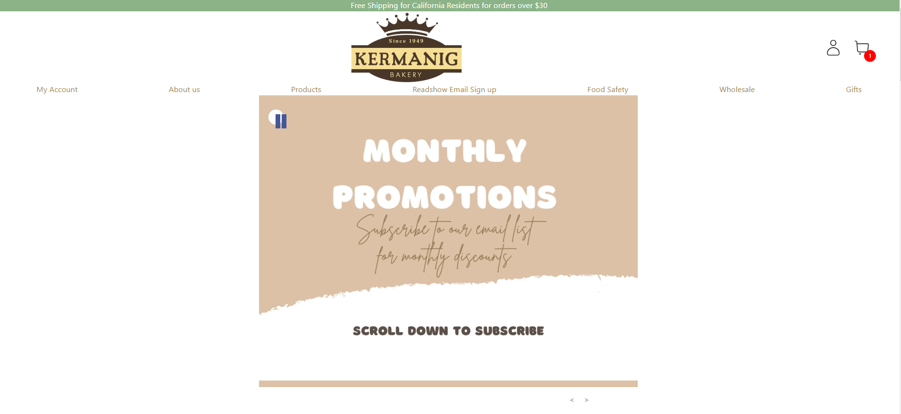
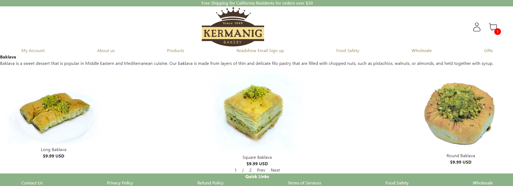
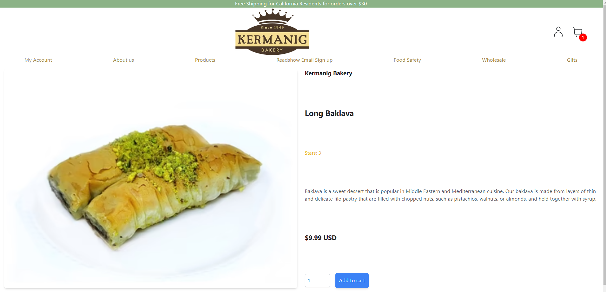
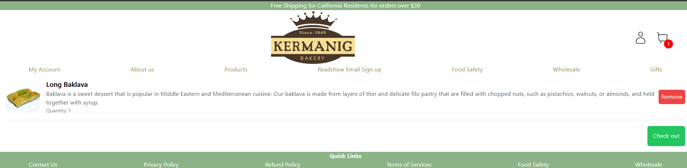
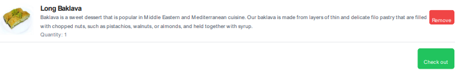
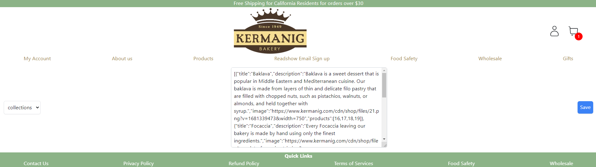

# KERMANIG APP

https://www.kermanig.com/ - Live Website













## Tasks

1. HomePage (https://www.kermanig.com/)

- Display the list advertising images using Carousel that is auto-playing
- Display the list of "collections" with image, title and description in the given layout
- Clicking the collection image should let the user navigate to its detail page

2. Collection Detail Page (https://www.kermanig.com/collections/baklava)

- Display the collection title, description and products (image, title and price) in pagination
- Clicking the product image should let the user navigate to its detail page

3. Product Detail Page (https://www.kermanig.com/products/baklava)

- Display the product image (choose one from the list), title, stars, description, price
- Display the "Quantity" input and "Add to cart" button to add the item to the cart
- Cart icon should display the number of items in the cart on Header component
  (Header component is visible on top of all the pages)
- Logo icon should be visible on Header component and clicking it should let the user navigate to HomePage
- Clicking "Cart" icon should let the user navigate to Cart page

4. Cart Page (https://www.kermanig.com/cart)

- Display the list of items in the cart with image, title and price
- Display the "Quantity" input and "Delete" button for each item to manage items in the cart
- Group the same product to be managed easily on the cart page
- Clicking "Check out" button should generate a PDF showing the list of cart items and save the PDF file on the backend
- Refreshing the page should persist the cart items

5. Admin Page

- Administrator should be able to manage all the "Product", "Collection", "Carousel" data in JSON format
- Clicking "Save" button should synchronize all the input data to the backend
- No DB is required but while designing data structure, make sure to follow the best practices
- Initially, define your own basic data for testing

## Environment

- Windows 11
- Node v16.19.1
- Npm 8.19.3

## Tech stacks

- Vite + React + Typescript
- Express

## API endpoints
- Read and Update Collections
    - URL: `/api/collections`
    - Method: `GET/POST`
- Read and Update Products
    - URL: `/api/products`
    - Method: `GET/POST`
- Read and Update Carousels
    - URL: `/api/carousels`
    - Method: `GET/POST`
- Getting collection detail by title
    - URL: `/api/collections/:title`
    - Method: `GET`

## Routes
- `/` (Home)
- `/collections/:title` (CollectionDetailsPage)
- `/products/:title` (ProductDetailsPage)
- `/cart` (CartPage)
- `/admin` (AdminPage)

## Steps to run program

1. Extract the repository.

2. Install node modules

   ```shell
   npm install
   ```

3. Run project
   ```shell
   npm run dev
   ```
   This will host the project on http://localhost:3000.
